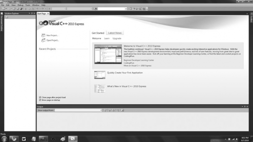
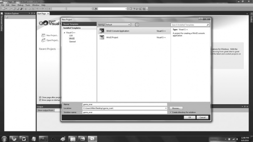
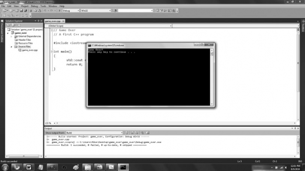

# Appendix A - Creating You First C++ Program

Follow these steps to write, save, compile, and run your first program using Mircosoft's Visual C++ 2010 Express, a popular and free IDE for the Windows platform.

1. Download Visual C++ 2010 Express from [https://www.mircosoft.com/express/downloads](https://www.mircosoft.com/express/downloads).
2. Install Visual C++ 2010 Express, accepting the default options.
3. Launch Visual C++ 2010 Express. You should see what appears in Figure A.1.
4. From the application menu, select File, New, Project. In the New Project dialog that appeats, select Win32 from the Installed Templates pane and select Win32 Console Application from the pane to the right. In the Name field, type **game_over**. In the location field, browse to the location to save your project by clicking the Browse button. I recommend create a new folder for the project. (I store my project in `C:\Users\Mike\Desktop\game_over\`.) Last but not least, make sure the check box is checked for Create directory for solution. Your New Project dialog should look similar to the one in Figure A.2.

### Hint
> It's generally a good idea to store each project in its own folder.



**Figure A.1** - Visual C++ 2010 Express on startup.



**Figure A.2** - The New Project dialog, filled out.

5. With the New Project dialog filled out, click the Okay button. This will bring up the Win32 Application Wizard-Overview. Click the Next button. This will take you to the Win32 Application Wizard-Application Settings. Under Additional option, check the check box for Empty project. Your screen shoudl look like Figure A.3.


**Figure A.3** - The Win32 Application Wizard - Application Settings, defining an empty project.

6. In the Win32 Application Wizard-Application Settings, click the Finish button. This will create and open a new solution for your project, as picture in Figure A.4.

### Hint
> If the Solution Explorer is not displayed, from the application menu, select View, Other Windows, Solution Explorer.

7. In the Solution Explorer, right-click the Source Files folder. From the menu that Appears, select Add, New Item. In the Add New Item dialog that appears, select C++ File (`.cpp`). In the Name field, type **game_over.cpp**. Check out Figure A.5 for a completed Add New Item dialog image.


**Figure A.4** - Your newly created project.


**Figure A.5** - The Add New Item dialog, filled out.

8. In the Add New Item dialog, click the Add button. The empty C++ file name `game_over.cpp` appears, ready for edition. In the `game_over.cpp` C++ file, type the following:

```cpp
// Game Over
// A first C++ program

#include <iostream>

int main()
{
    std::cout << "Game Over!" << std::endl;
	return 0;
}
```
Your screen should look like Figure A.6.

9. From the application menu, select File, Save.


**Figure A.6** - Your new C++ file, edited.

10. From the application menu, select Debug, Build Solution.
11. Press `Ctrl+F5` to run the project and enjoy the fruits of your labor. You should see the results shown in Figure A.7.



**Figure A.7** - The big payoff: seeing your program run.

Congratulations! You've written, saved, complied, and run your C++ program.

### Hint
> For more detailed information about Mircosoft Visual C++ 2021 Express, please see its documentation.
