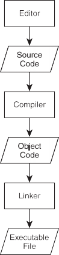

# Introducing the Game Over Program


The classic first task a programmer tackles in a new language is the Hello World program, which displays Hello World on the screen. The Game Over program puts a gaming twist on the classic and displays Game Over! instead.

## Introducing C++

C++ is leveraged by millions of programmers around the world. It’s one of the most popular languages for writing computer applications—and the most popular language for writing big-budget computer games.

Created by Bjarne Stroustrup, C++ is a direct descendant of the C language. In fact, C++ retains almost all of C as a subset. However, C++ offers better ways to do things and some brand-new capabilities, too.

## Using C++ for Games

There are a variety of reasons why game programmers choose C++. Here are a few:
- **It’s fast.** Well-written C++ programs can be blazingly fast. One of C++’s design goals is performance. And if you need to squeeze out even more performance from your programs, C++ allows you to use assembly language—the lowest-level, human-readable programming language—to communicate directly with the computer’s hardware.
- **It’s flexible.** C++ is a multi-paradigm language that supports different styles of programming, including *object-oriented programming*. Unlike some other modern languages, though, C++ doesn’t force one particular style on a programmer.
- **It’s well-supported.** Because of its long history in the game industry, there’s a large pool of assets available to the C++ game programmer, including graphics APIs and 2D, 3D, physics, and sound engines. All of this pre-exiting code can be leveraged by a C++ programmer to greatly speed up the process of writing a new game.

## Creating Executetable File

The file that you run to launch a program—whether you’re talking about a game or a business application—is an *executable file*. There are several steps to creating an executable file from C++ *source code* (a collection of instructions in the C++ language). The process is illustrated in Figure 1.1.

1. First, the programmer uses an *editor* to write the C++ source code, a file that usually has the extension `.cpp`. The editor is like a word processor for programs; it allows a programmer to create, edit, and save source code.
2. After the programmer saves a source file, he or she invokes a C++ *compiler*—an application that reads source code and translates it into an *object file*. Object files usually have the extension `.obj`.
3. Next, a linker links the object file to any external files as necessary, and then creates the executable file, which generally ends with the extension `.exe`. At this point, a user (or gamer) can run the program by launching the executable file.



**Figure 1.1** - The creation of an executed file from C++ source code.

### Hint
> he process I’ve described is the simple case. Creating a complex application in C++ often involves multiple source code files written by a programmer (or even a team of programmers).

To help automate this process, it’s common for a programmer to use an all-in- one tool for development, called an IDE (*Integrated Development Environment*). An IDE typically combines an editor, a compiler, and a linker, along with other tools. A popular (and free) IDE for Windows is Microsoft’s Visual C++ Express Edition. You can find out more about this IDE (and download a copy) at [http:// www.microsoft.com/express/](http:// www.microsoft.com/express/).

## Dealing with Errors

When I described the process for creating an executable from C++ source, I left out one minor detail—errors. If to err is human, then programmers are the most human of us. Even the best programmers write code that generates errors the first (or fifth) time through. Programmers must fix the errors and start the entire process over. Here are the basic types of errors you’ll run into as you program in C++:

- **Compile errors.** These occur during code compilation. As a result, an object file is not produced. These can be *syntax* errors, meaning that the compiler doesn’t understand something. They’re often caused by some- thing as simple as a typo. Compilers can issue warnings, too. Although you usually don’t have to heed the warnings, you should treat them as errors, fix them, and recompile.
- **Link errors.** These occur during the linking process and may indicate that something the program references externally can’t be found. These errors are usually solved by adjusting the offending reference and starting the compile/link process again.
- **Run-time errors**. These occur when the executable is run. If the program does something illegal, it can crash abruptly. But a more subtle form of run-time error, a *logical error*, can make the program simply behave in unintended ways. If you’ve ever played a game where a character walked on air (that is, a character who shouldn’t be able to walk on air), then you’ve seen a logical error in action.

### Real World
> Like other software creators, game companies work hard to produce bug-free products. Their last line of defense is the quality assurance personnel (the game testers). Game testers play games for a living, but their jobs are not as fun as you might think. Testers must play the same parts of a game over and over—perhaps hundreds of times—trying the unexpected and meticulously recording any anomalies. On top of monotonous work, the pay ain’t great either. But being a tester is a terrific way to get into a game company on the proverbial bottom rung.

## Understanding the ISO Standard

The *ISO standard* for C++ is a definition of C++ that describes exactly how the language should work. It also defines a group of files, called the *standard library*, that contain building blocks for common programming tasks, such as *I/O*— getting input and displaying output. The standard library makes life easier for programmers and provides fundamental code to save them from reinventing the wheel. I’ll be using the standard library in all of the programs in this book.

### Hint
> The ISO standard is often called the *ANSI* standard or *ANSI/ISO* standard. These different names involve the acronyms of the various committees that have reviewed and established the standard. The most common way to refer to C++ code that conforms to the ISO standard is simply *Standard C++*.

I used Microsoft’s Visual C++ 2010 Express Edition to develop the programs in this book. The compiler that’s a part of this IDE is pretty faithful to the ISO standard, so you should be able to compile, link, and run all of the programs using some other modern compiler as well. However, if you’re using Windows, I recommend using Visual C++.

### Hint
> For step-by-step instructions on how to create, save, compile, and run the Game Over program using Microsoft Visual C++ 2010 Express Edition, check out [Appendix A](../../../Appendix/AppendixA/). If you’re using another compiler or IDE, check its documentation.

## Writing Your First C++ Program
Okay, enough theory. It’s time to get down to the nitty-gritty and write your first C++ program. Although it is simple, the following program shows you the basic anatomy of a program. It also demonstrates how to display text in a console window.

## Commenting Code
The first two lines of the program are comments.
```cpp
// Game Over
// A first C++ program
```
Comments are completely ignored by the compiler; they’re meant for humans. They can help other programmers understand your intentions. But comments can also help you. They can remind you how you accomplished something that might not be clear at first glance.

You can create a comment using two forward slashes in a row (//). Anything after this on the rest of the physical line is considered part of the comment. This means you can also include a comment after a piece of ++ code, on the same line.

### Hint
> You can also use what are called C-style comments, which can span multiple lines. All you have to do is start the comment with /* and end it with */. Everything in between the two markers is part of the comment.

## Using Whitespace
The next line in the program is a blank line. The compiler ignores blank lines. In fact, compilers ignore just about all *whitespace*—spaces, tabs, and newlines. Like comments, whitespace is just for us humans.

Judicious use of whitespace helps make programs clearer. For example, you can use blank lines to separate sections of code that belong together. I also use whitespace (a tab, to be precise) at the beginning of the two lines between the curly braces to set them off.

## Including Other Files
The next line in the program is a preprocessor directive. You know this because the line begins with the # symbol.
```cpp
#include <iostream>
```
The *preprocessor* runs before the compiler does its thing and substitutes text based on various directives. In this case, the line involves the #include directive, which tells the preprocessor to include the contents of another file.

I include the file `iostream`, which is part of the standard library, because it contains code to help me display output. I surround the filename with less than (<) and greater than (>) characters to tell the compiler to find the file where it keeps all the files that came with the compiler. A file that you include in your programs like this is called a *header file*.

## Defining the main() Function
The next non-blank line is the header of a function called main().
```cpp
int main()
```
A *function* is a group of programming code that can do some work and return a value. In this case, int indicates that the function will return an integer value. All function headers have a pair of parentheses after the function name.

All ++ programs must have a function called main(), which is the starting point of the program. The real action begins here.
The next line marks the beginning of the function.
```txt
{

And the very last line of the program marks the end of the function.

}
```

All functions are delimited by a pair of curly braces, and everything between them is part of the function. Code between two curly braces is called a *block* and is usually indented to show that it forms a unit. The block of code that makes up an entire function is called the *body* of the function.

## Displaying Text through the Standard Output
The first line in the body of main() displays Game Over!, followed by a newline, in the console window.
```cpp
std::cout << "Game Over!" << std::endl;
```
"Game Over!" is a *string*—a series of printable characters. Technically, it’s a *string literal*, meaning it’s literally the characters between the quotes.

`cout` is an object, defined in the file `iostream`, that’s used to send data to the standard output stream. In most programs (including this one), the standard output stream simply means the console window on the computer screen.

I use the *output operator* (<<) to send the string to `cout`. You can think of the output operator like a funnel; it takes whatever’s on the open side and funnels it to the pointy side. So the string is funneled to the standard output—the screen.

I use `std` to prefix `cout` to tell the compiler that I mean `cout` from the standard library. `std` is a *namespace*. You can think of a namespace like an area code of a phone number—it identifies the group to which something belongs. You prefix a namespace using the *scope resolution operator* (::).

Finally, I send `std::endl` to the standard output. `endl` is defined in `iostream` and is also an object in the std namespace. Sending `endl` to the standard output acts like pressing the Enter key in the console window. In fact, if I were to send another string to the console window, it would appear on the next line.

I understand this might be a lot to take in, so check out Figure 1.3 for a visual representation of the relationship between all of the elements I’ve just described.

## Terminating Statements
You’ll notice that the first line of the function ends with a semicolon (;). That’s because the line is a *statement*—the basic unit controlling the execution flow. All of your statements must end with a semicolon—otherwise, your compiler will complain with an error message and your program won’t compile.

## Returning a Value from main()
The last statement in the function returns 0 to the operating system.
```cpp
return 0;
```
Returning 0 from `main()` is a way to indicate that the program ended without a problem. The operating system doesn’t have to do anything with the return value. In general, you can simply return 0 like I did here.

### Trick
> When you run the Game Over program, you might only see a console window appear and disappear just as quickly. That’s because ++ is so fast that it opens a console window, displays `Game Over!`, and closes the window all in a split second. However, in Windows, you can create a batch file that runs your console program and pauses, keeping the console window open so you can see the results of your program. Since the compiled program is named `game_over.exe`, you can simply create a batch file comprised of the two lines
```bat
   game_over.exe
   pause
```
To create a batch file:

1. Open a text editor like Notepad (not Word or WordPad).
2. Type your text.
3. Save the file with a .bat extension, such as game_over.bat.

> Finally, run the batch file by double-clicking its icon. You should see the results of the program since the batch file keeps the console window open.

# Code
```cpp
// Game Over
// A first C++ program

#include <iostream>

int main()
{
    std::cout << "Game Over!" << std::endl;
	return 0;
}
```
# Output
```txt
Game Over!
```