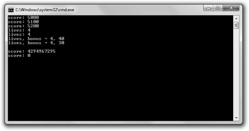

[Docs](../../../docs/) / [Chapter1](../../) / [GameStats](../)
# Introducing the Game Stats 2.0 Program



The Game Stats 2.0 program manipulates variables that represent game stats and displays the results. Figure 1.6 shows the program in action.

## Performing Arithmetic Operations with Variables

Once you have variables with values, you’ll want to change their values during the course of your game. You might want to add a bonus to a player’s score for defeating a boss, increasing the score. Or you might want to decrease the oxygen level in an airlock. By using operators you’ve already met (along with some new ones), you can accomplish all of this.

### Trap
> When you compile this program, you may get a warning similar to, “[Warning] this decimal constant is unsigned.” Fortunately, the warning does not stop the program from compiling and being run. The warning is the result of something called integer wrap around that you’ll probably want to avoid in your own programs; however, the wrap around is intentional in this program to show the results of the event. You’ll learn about integer wrap around in the discussion of this program, in the section “Dealing with Integer Wrap Around.”

## Altering the Value of a Variable

After I create a variable to hold the player’s score and display it, I alter the score by increasing it by 100.
```cpp
score = score + 100;
```

This assignment statement says to take the current value of `score`, add 100, and
assign the result back to `score`. In effect, the line increases the value of `score` by 100.

## Using Combined Assignment Operators

There’s an even shorter version of the preceding line, which I use next.

```cpp
score += 100;
```

This statement produces the same results as score = score + 100;. The += operator is called a *combined assignment operator* because it combines an arithmetic operation (addition, in this case) with assignment. This operator is shorthand for saying “add whatever’s on the right to what’s on the left and assign the result back to what’s on the left.”

There are versions of the combined assignment operator for all of the arithmetic operators you’ve met. To see a list, check out Table 1.2.

Table 1.2 - Combined Assignment Operators

| Operator | Example | Equivalent To |
|----------|---------|---------------|
| +=       | x += 5; | x = x + 5;    |
| -=       | x -= 5; | x = x - 5;    |
| *=       | x *= 5; | x = x * 5;    |
| /=       | 5 /= 5; | x = x / 5;    |
| %=       | x %= 5; | x = x % 5;    |

## Using Increment and Decrement Operators

Next, I use the *increment operator* (++) which increases the value of a variable by one. I use the operator to increase the value of `lives` twice. First I use it in the following line:

```cpp
++lives;
```

Then I use it again in the following line:

```cpp
lives++;
```

Each line has the same net effect; it increments `lives` from 3 to 4.

As you can see, you can place the operator before or after the variable you’re incrementing. When you place the operator before the variable, the operator is called the *prefix increment operator*; when you place it after the variable, it’s called the *postfix increment operator*.

At this point, you might be thinking that there’s no difference between the postfix and prefix versions, but you’d be wrong. In a situation where you only increment a single variable (as you just saw), both operators produce the same final result. But in a more complex expression, the results can be different.

To demonstrate this important difference, I perform a calculation that would be appropriate for the end of a game level. I calculate a bonus based on the number of lives a player has, and I also increment the number of lives. However, I perform this calculation in two different ways. The first time, I use the prefix increment operator.

```cpp
int bonus = ++lives * 10;
```

The prefix increment operator increments a variable *before* the evaluation of a larger expression involving the variable. ++lives * 10 is evaluated by first incrementing `lives`, and then multiplying that result by 10. Therefore, the code is equivalent to 4 * 10, which is 40, of course. This means that now `lives` is 4 and `bonus` is 40.

After setting `lives` back to 3, I calculate `bonus` again, this time using the postfix increment operator.

```cpp
bonus = lives++ * 10;
```

The postfix increment operator increments a variable *after* the evaluation of a larger expression involving the variable. `lives++` * 10 is evaluated by multi- plying the current value of `lives` by 10. Therefore, the code is equivalent to 3 * 10, which is 30, of course. Then, after this calculation, `lives` is incremented. After the line is executed, `lives` is 4 and `bonus` is 30.

C++ also defines the *decrement operator*, –. It works just like the increment operator, except it decrements a variable. It comes in the two flavors (prefix and postfix) as well.

## Dealing with Integer Wrap Around

What happens when you increase an integer variable beyond its maximum value? It turns out you don’t generate an error. Instead, the value “wraps around” to the type’s minimum value. Next up, I demonstrate this phenomenon. First I assign `score` the largest value it can hold.

```cpp
score = 4294967295;
```

Then I increment the variable.

```cpp
++score;
```

As a result, `score` becomes 0 because the value wrapped around, much like a car odometer does when it goes beyond its maximum value (see Figure 1.7).

Decrementing an integer variable beyond its minimum value “wraps it around” to its maximum.

### Hint
> Make sure to pick an integer type that has a large enough range for its intended use.

# Code
```cpp
// Game Stats 2.0
// Demonstrates arithmetic operations with variables

#include <iostream>
using namespace std;

int main()
{
	unsigned int score = 5000;
	cout << "score: " << score << endl;

	//altering the value of a variable
	score = score + 100;
	cout << "score: " << score << endl;

	//combined assignment oprtator
	score += 100;
	cout << "score: " << score << endl;

	//increment operatiors 
	int lives = 3;
	++lives;
	cout << "lives: " << lives << endl;

	lives = 3;
	lives++;
	cout << "lives: " << lives << endl;

	lives = 3;
	int bonus = ++lives * 10;
	cout << "lives, bonus = " << lives << ", " << bonus << endl;

	lives = 3;
	bonus = lives++ * 10;
	cout << "lives, bonus = " << lives << ", " << bonus << endl;

	//integer wrap around
	score = 4294967295;
	cout << "\nscore: " << score << endl;
	++score;
	cout << "score: " << score << endl;

	return 0;
}
```

# Output
```txt
score: 5000
score: 5100
score: 5200
lives: 4
lives: 4
lives, bonus = 4, 40
lives, bonus = 4, 30

score: 4294967295
score: 0
```