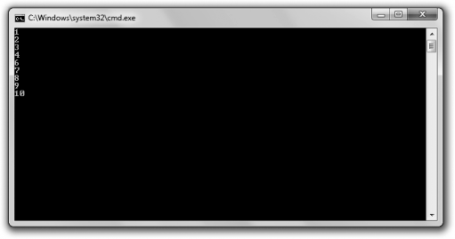

[Docs](../../) / [Chapter2](../)
# Introducing the Finicky Counter Program



The Finicky Counter program counts from 1 to 10 though a `while` loop. It's finicky because it doesn't like the number 5-it skips it.

## Creating a while (true) Loop

I set up the loop with the following line:

```cpp
while(true)
```

Technically, this creates an infinite loop. This might seem odd coming so soon after a warning to avoid infinite loops, but this particular loop isn't really infinite because I put an exit condition in the loop body.


### Hint
> Although a `while(true)` loop sometimes can be clearer than a traditional loop, you should also try to minimize your use of these loops.

## Using the break Statement to Exit a Loop

This is the exit condition I put in the loop:

```cpp
//end loop if count is greater than 10
if(count > 10)
{
    break;
}
```

Because `count` is increased by 1 each time the loop body begins, it will eventually reach 11. When it does, the `break` statement (which means "break out of the loop") is executed and the loop ends.

## Using the continue Statement to Jump Back to the Top of a Loop

Just before `count` is displayed, I included the lines:
```cpp
//skip the number 5
if (count == 5)
{
    continue;
}
```

The `continue` statement means "jump back to the top of the loop." At the top of the loop, the `while` expression is tested and the loop is entered again if it's true. So when `count` is equal to 5, the program does not get to the `cout << count << end1;` statement. Instead, it goes right back to the top of the loop. As a result, 5 is skipped and never displayed.

## Understanding When to Use break and continue

You can use `break` and `continue` in any loop you createl they aren't just for `while (true)` loops. But you should use them sparingly. Both `break` and `continue` can make it harder for programmers to see the flow of a loop.

## Using Logical Operators

So far you've seen pretty simple expression evaluated for their truth or falisty. However, you can combine simpler expressions with *logical operators* to create more complex expressions. Table 2.2 lists the logical operators.

Table 2.2 - Logical Operators

| Operator 	| Description  	| Sample Expression 	|
|---	|---	|---	|
| ! 	| Logical NOT 	| `!expression` 	|
| && 	| Logical AND 	| `expression1 && expression2` 	|
| \|\| 	| Logical OR 	| `expression1 \|\| expression2` 	|

# Code
```cpp
// Finicky Counter 
// Demonstrates break and continue statements

#include <iostream>
using namespace std;

int main() {
	int count = 0;
	while (true) {
		count += 1;

		//ends loop of count is greater than 10
		if (count > 10) {
			break;
		}

		//skip the number 5
		if (count == 5) {
			continue;
		}

		cout << count << endl;
	}
}
```

# Output
```txt
1
2
3
4
6
7
8
9
10
```