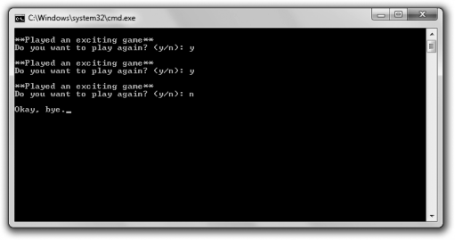

[Docs](../../../) / [Chapter2](../../) / [PlayAgain](../)
# Introducing the Play Again Program



The Play Again program simulates the play of an exciting game. (Okay, by "simulates the play of an exciting game," I mean the program displays the message "**Played an excited game**".) Then the program asks the user if he wants to play again. The user continues to play as long as he enters `y`. The program accomplishes this repetition using a `while` loop.

## Looping with a while Loop

The first thing the program does in the `main()` function is declare the `char` variable named `again` and initialize it to '`y`'. Then the program begins the `while` loop by testing `again` to see whether it's eqaul to '`y`'. Because it is, the program displays the message "**Played an exciting game**," asks the user whether he wants to play again, and stores the reply in `again`. The loop continues as long as the user enters `y`.

You'll notice that I had to inititalize `again` before the loop because the variable is used in the loop expression. Because a `while` loop evaluates its expressions before its *loop body* (the group of statements that repeat), you have to make sure that nay variables in the experssion have a value before the loop begins.

## Using do Loops

Like `while` loops, `do` loops let you repeat a section of code based on an expression. The difference is that a `do` loop tests its expression after each loop iteration. The difference is that a `do` loop tests its expression after each loop iteration. This means that the loop body is always executed at least once. Here's a generic form of a `do` loop:

```cpp
do
    statement;
while (expression)l
```

The program executes `statement` and then, as long as `expression` test `true`, the loops repeats. Once `expression` test `false`, the loop ends.

# Code
```cpp
// Play Again 
// Demostrates while loops

#include <iostream>
using namespace std;

int main() {
	char again = 'y';
	while (again == 'y') {
		cout << "\n**Played an exciting game**";
		cout << "\nDo you want to play again? (y/n): ";
		cin >> again;
	}

	cout << "\nOkay, bye.";
	return 0;
}
```

# Output 
```txt
**Played an exciting game**       
Do you want to play again? (y/n): y

**Played an exciting game**       
Do you want to play again? (y/n): n

Okay, bye.
```